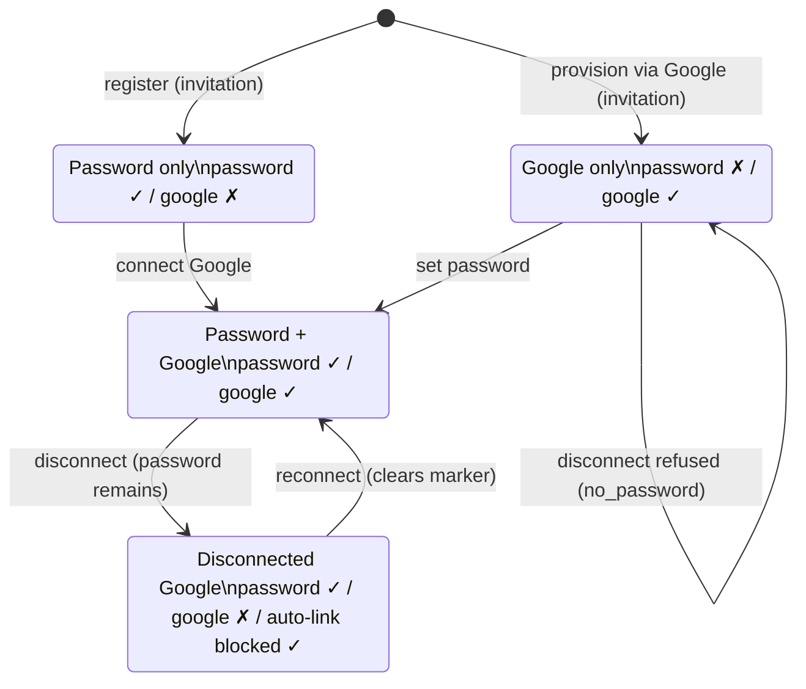

# ADR-013: Google OAuth Sign-In

## Status

Accepted (amended 2026-07 by #144: Google sign-in resolves the internal user by `googleSubject`, not email; email becomes mutable profile data. Amended 2026-07 by #131: self-service explicit connect/disconnect with a durable disconnect marker and a signed, session-bound link intent).

## Guiding Principle

> Alliance Command Center treats OAuth providers as authentication mechanisms only. Authorization and account eligibility remain governed by the platform's invitation model and verified email identity.

Authentication establishes identity. Authorization determines eligibility. AllianceHQ intentionally keeps these concerns separate so authentication providers remain interchangeable while platform access continues to be governed by invitation and domain rules.

## Context

The platform is invitation-only. Registration locks the email to the invitation and requires a password. For the upcoming beta we want to reduce onboarding friction with "Continue with Google" while preserving the invitation model.

The existing auth stack is Auth.js v5 with a **Credentials** provider, **JWT** sessions, and **no Prisma adapter**. Identity is the user's email (`User.email` is unique). There are no `Account`, `Session`, or `VerificationToken` tables.

## Decision

Add Google as an additional authentication provider using a **custom `signIn` callback**, not the Prisma adapter. Google proves the user owns a verified email; the invitation model decides whether that email may access the platform.

### Layers

| Layer | Responsibility | Location |
|-------|----------------|----------|
| Google profile | Who are you? | Auth.js Google provider |
| Identity | Is this Google account trustworthy? | `identity/google.ts` - `assertVerifiedGoogleEmail` |
| Eligibility | Are you allowed onto the platform? | `identity/eligibility.ts` - `isInvitationEligible` |
| Provisioning | How is this person represented in our domain? | `provisionOAuthUser` |

### Sign-in flow (Google)

Resolution is owned by `resolveGoogleUser` so the `signIn` callback only orchestrates. The subject (`sub`) is the resolution key; a verified email is used only to link an existing account on first sign-in and to provision a new one (#144).

1. `assertVerifiedGoogleEmail(profile)` - requires `email_verified === true`; returns the normalized email. Throws `UnverifiedEmailError` otherwise.
2. `assertGoogleSubject(profile)` - returns Google's stable subject (`sub`). Throws `MissingGoogleSubjectError` if absent.
3. **By subject:** if a `User` is anchored to that `sub`, that is the returning user. Sign them in as-is; their stored email/display name may have diverged from Google and are left untouched.
4. **By email (first-time link / lazy backfill):** otherwise, if a `User` exists for the verified email, `ensureGoogleIdentity(user, sub)` links the subject (or verifies it) and throws `GoogleAccountMismatchError` if a different subject is already anchored.
5. **Provision:** otherwise `isInvitationEligible(email)` must be true (a pending beta OR alliance invitation), else `InvitationRequiredError`; then `provisionOAuthUser({ email, displayName, googleSubject: sub })` creates the user, anchoring the subject and leaving `passwordHash: null`.

`resolveGoogleUser` guarantees a postcondition of `user.googleSubject === sub` on success, which the JWT callback relies on. Failures throw typed errors (`AuthenticationError` subclasses); the callback catches them and returns `false`, which Auth.js surfaces as `AccessDenied` on `/login`.

### Identity model

**Authentication capabilities are modeled as the presence of provider-specific credentials, not as a mutually exclusive provider enum.** Business logic determines whether a login method is available by checking the corresponding capability (`passwordHash`, `googleSubject`, ...) rather than a separate provider field.

- `User.passwordHash` (optional) present -> **password login is enabled**.
- `User.googleSubject` (optional, `@unique`) present -> **Google login is enabled**. It stores Google's stable subject as the security anchor.
- A user may have **both**, enabling password + Google on the same canonical identity (email). This is a deliberate exception, primarily so the operator's break-glass account keeps a password while also using "Continue with Google." It is not an accident to be "simplified" back to one provider.
- Password login is gated purely on the capability: `if (!user.passwordHash) return null`.
- The retired `authProvider` enum could not express "both" and modeled *how a user authenticated* rather than *what an identity can do*; capabilities are the more durable and extensible abstraction (a future provider becomes another nullable column, not another enum state).

#### Security anchor: `sub` is identity, email is profile data

> **Identity providers authenticate users; AllianceHQ owns user profile data.** After an account is linked, the OAuth provider's subject is the immutable identity key, while user profile fields such as email are managed by AllianceHQ.

A verified email proves ownership *at sign-in time*, but emails can be reassigned — and AllianceHQ already lets users change their own email (verified email change). Google-linked accounts cannot yet do so; a fast-follow (#147) lifts that authorization restriction. Resolving Google sign-in by `googleSubject` rather than email is the prerequisite that makes it safe, because a user's stored email can then diverge from the email Google reports without breaking sign-in. Google sign-in therefore resolves the internal user by `googleSubject` first; the verified email is consulted only to link an existing account on the first Google sign-in (and as the lazy backfill path for accounts that predate subject storage) and to provision a new one. Once anchored, we assert the incoming `sub` matches on every subsequent sign-in and refuse to silently re-link a different one (`GoogleAccountMismatchError`), and we never resync the provider's email/name back onto the stored profile. Existing Google-only users predate subject storage; rather than a backfill script, they are anchored on their next Google sign-in (the by-email branch).

Linking is concurrency-safe. `ensureGoogleIdentity` uses a guarded write (`updateMany where { id, googleSubject: null }`) so a subject anchored by a racing sign-in between read and write is never clobbered; on a no-op it re-reads and only allows an identical subject, denying otherwise. The `@unique` constraint on `googleSubject` additionally rejects anchoring a subject already owned by a different user. Because `provisionOAuthUser` is find-or-create, the new-user branch also re-runs `ensureGoogleIdentity` on the returned user, so an email-unique race can't bypass the invariant.

### JWT invariant

After authentication, every JWT `sub` claim contains the internal `User.id`, regardless of provider. For Google, the incoming `user.id` is the Google subject; because `signIn` runs first and guarantees the account is anchored to that subject (`resolveGoogleUser`'s postcondition), the `jwt` callback resolves our cuid by `googleSubject`. Everything downstream continues to assume `session.user.id` is our own identifier.

### Self-service connect / disconnect (#131)

A signed-in user can explicitly connect or disconnect Google from Account &gt; Sign-in methods. This is **identity management**, layered on the **identity resolution** of #144: the domain owns the policy, the callback orchestrates.

**Connect is an explicit link to the current user, not an email match.** Because #144 decoupled email from identity, connecting must bind the returning Google subject to the *current session's* user even when the app email and the Google email differ. The connect action mints a signed, session-bound **link intent** (see below) and starts the OAuth challenge; the `signIn` callback verifies the intent and calls `linkGoogleToUser`, which delegates the subject invariant to `ensureGoogleIdentity` and clears `googleAutoLinkBlockedAt`. Because the intent targets the current `User.id` and the JWT resolves by `googleSubject`, `token.sub` stays the same user — the session is continuous.

**Disconnect is lockout-safe and durable.** `disconnectGoogle` clears `googleSubject` with a single guarded write (`updateMany where { id, googleSubject != null, passwordHash != null }`) so a user can never remove their last sign-in method; the boundary maps a zero-count write to `no_password` (lockout refused) or `not_connected` (nothing to do). The same write sets `googleAutoLinkBlockedAt`.

**Connecting Google never changes the AllianceHQ email.** Linking records the Google account's identity (`googleSubject`) and, as *display metadata only*, the verified Google email in `googleEmail` — it is never copied into `User.email`. This is the same principle #144 established, applied to connect: Google authenticates the user; AllianceHQ owns the profile. Silently overwriting the account email on connect would quietly re-collapse the two concepts and could ripple into password login, notifications, invitation reconciliation, and email uniqueness. `googleEmail` is nullable, non-unique, cleared on disconnect, and refreshed on later Google sign-ins so "Connected as &lt;email&gt;" stays current. Adopting the connected Google address *as* the account email is an explicit, user-initiated email change (with confirmation, atomic update, invitation reconciliation, and session policy) folded into #147 — not a side effect of connecting.

**Durable disconnect (`googleAutoLinkBlockedAt`).** Without a marker, `googleSubject = null` is ambiguous: it means both "legacy account awaiting its first link" and "user intentionally disconnected." The by-email link path would then silently re-link a disconnected account on the next normal Google sign-in. The nullable `User.googleAutoLinkBlockedAt` timestamp removes the ambiguity: set on disconnect, it makes the by-email branch of `resolveGoogleUser` refuse to auto-link (`GoogleAutoLinkBlockedError`), and `ensureGoogleIdentity`'s guarded write additionally re-checks `googleAutoLinkBlockedAt: null` (via `requireAutoLinkEnabled`) so a disconnect landing mid-sign-in can't be clobbered. Explicit connect clears the marker, because a deliberate reconnect overrides a prior deliberate disconnect.

**Re-authentication policy.**

| Action | Proof required | Sessions |
|--------|----------------|----------|
| Connect | The Google OAuth challenge itself (no extra password prompt) | Unchanged |
| Disconnect | Current-password re-auth | Unchanged (not revoked) |

Disconnect intentionally does **not** bump `sessionVersion`: it is self-service account management, not a credential compromise, so existing sessions stay valid.

#### Link-intent threat model (cookie-only)

The intent is a cookie carrying `{ purpose, version, userId, sessionVersion, nonce, expiresAt }`, HMAC-SHA256 signed with `AUTH_SECRET` (httpOnly, `Secure` in production, `SameSite=Lax`, short ~10-minute TTL). At the callback we re-verify the signature, purpose, version, and expiry, and re-check that the DB `sessionVersion` still matches — so a password change or session revocation during the OAuth round trip invalidates an in-flight connect.

Reading the intent is **fail-closed and typed**: `absent | valid | invalid`. An `invalid` intent (expired, malformed, tampered, wrong purpose) is *denied*, never downgraded to a normal sign-in, so a stale or forged intent can't switch the browser to a different account. Numeric fields (`sessionVersion`, `expiresAt`) are validated as finite integers, so a malformed-but-signed `NaN`/`Infinity` cannot satisfy the expiry check and slip through as `valid`. The intent is single-use in-browser: it is cleared on every terminal outcome.

**Sign-out drops the intent.** Sign-out does not bump `sessionVersion`, so the `sessionVersion` check alone would not invalidate a pending intent when a user signs out. On a shared device this is the meaningful escalation: a user starts a connect, signs out, and someone else then completes an OAuth flow that would link *their* Google account to the signed-out user. The `events.signOut` hook clears the intent when the session ends, closing that window. (The variant where the user stays signed in and walks away mid-consent is not an additional escalation — the attacker would already hold the victim's active session.)

Known limitation: this is signed and session-version-bound but **not** a server-side single-use token. A captured cookie could in principle be replayed within its TTL, but only in an already-compromised browser whose `sessionVersion` has not changed. A DB-backed hashed single-use intent is the strongest option and is deferred as future hardening; cookie-only is acceptable for beta with this limitation stated rather than hidden.

The connect outcome is surfaced to `/account` via a separate short-lived, signed **connect-result** cookie (`connected | already_in_use | intent_expired | unavailable`) read once and acknowledged, rather than a query parameter (a denied sign-in is an Auth.js `AccessDenied` redirect that doesn't preserve `redirectTo`). Logging for connect/disconnect records only a `userId` and a coarse reason — never subjects, tokens, cookie values, or signatures. A full user-facing audit log is deferred to #86.

### Identity state machine

The valid capability states and their transitions. A user must always occupy a state with at least one sign-in method (never "password ✗ + google ✗").

Notes:
- `Disconnected` differs from `PasswordOnly` only by `googleAutoLinkBlockedAt` being set: a normal Google sign-in by matching email is refused in `Disconnected` but auto-links in `PasswordOnly` (legacy). This is the memory the marker adds.
- There is no transition out of `GoogleOnly` via disconnect: the lockout guard refuses it. The user must first `set password` to reach `PasswordGoogle`, from which disconnect is allowed.

## Why no Prisma adapter

We already own the `User` lifecycle, invitations, JWT sessions, and a clean domain model, with email as canonical identity. Adding `Account`/`Session`/`VerificationToken` tables solely because Google exists would complicate persistence without solving a current problem. If AllianceHQ later supports several providers, passkeys, or enterprise SSO, that is the point to revisit the adapter.

## Consequences

### Benefits

- Minimal schema.
- No framework-specific persistence.
- Invitation model remains authoritative.
- JWT remains unchanged.
- Existing authorization logic is preserved.

### Trade-offs

- Linking is both automatic (first Google sign-in by verified email, for legacy/unblocked accounts) and explicit (self-service connect, #131); a durable `googleAutoLinkBlockedAt` marker keeps the two from fighting.
- The link intent is a signed, session-bound cookie, not a server-side single-use token (documented limitation; DB-backed intents deferred).
- Only the Google subject (identity) and the verified Google email (display metadata) are persisted; no OAuth tokens or broader profile.
- Each additional provider adds another nullable capability column (acceptable, and simpler than an `Account` table).

## Configuration

Google is enabled only when `AUTH_GOOGLE_ID` and `AUTH_GOOGLE_SECRET` are both set, so local/CI environments without credentials are unaffected. Redirect URI: `<origin>/api/auth/callback/google`.

## Manual Acceptance Checklist

- Existing password user signs in with Google (same email) -> Google subject linked; both password and Google logins then work.
- Same user signs in with Google again -> subject verified, no duplicate/relink.
- Google user whose stored AllianceHQ email differs from Google's email signs in with Google -> resolved by `googleSubject`; the stored email/display name are left unchanged (not resynced from Google).
- Legacy Google user with a null `googleSubject` signs in -> anchored via the by-email branch; subsequent sign-ins resolve by subject.
- A different Google account (different `sub`) presenting the same verified email -> access denied (`GoogleAccountMismatchError`).
- Invited email with no account signs in with Google -> account created and anchored to the subject, invitation flow continues.
- Uninvited email signs in with Google -> access denied.
- Google account with `email_verified = false` -> access denied.
- Google-only user (no `passwordHash`) attempts password login -> rejected.
- Password user continues signing in with password -> unaffected.

### Self-service connect / disconnect (#131)

- Signed-in password-only user clicks Connect, whose Google email differs from the app email -> Google links to the current account (not by email); session stays continuous; banner confirms connection. The account email is unchanged; the panel shows "Connected as &lt;google email&gt;".
- Disconnect a `password + Google` account (current-password re-auth) -> `googleSubject` cleared, `googleAutoLinkBlockedAt` set, session stays valid.
- After disconnect, a normal Google sign-in with the same verified email -> refused (`GoogleAutoLinkBlockedError`); the disconnect is durable.
- Explicit reconnect after disconnect -> links and clears `googleAutoLinkBlockedAt`; normal sign-in resolves again afterward.
- Connect a Google account already anchored to a different user -> denied, no identity switch; banner: already in use.
- Disconnect on a Google-only account (no password) -> control disabled in UI and refused server-side (`no_password`).
- Password change or "sign out everywhere" during a connect round trip -> intent invalidated by `sessionVersion` mismatch; connect denied.
- Sign out during a connect round trip -> intent cleared by the `signOut` event; a later OAuth on a shared device is `absent` (normal sign-in as that Google account), never a link to the signed-out user.
- Tampered/expired/absent intent -> `invalid`/`absent`; an `invalid` intent is denied (never a normal sign-in).
