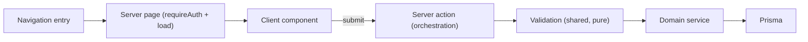

# Building a Vertical Slice

This guide describes how features are built in Alliance Command Center. It is a
reference, not a stencil. The goal is a consistent, reviewable shape for most
features, while leaving room to deviate when a slice is genuinely different.

If you read only one thing: a good slice does one coherent thing end to end,
names its non-goals explicitly, and keeps each layer's responsibility clear.

## Reference implementation

The canonical example is **PR #128: Account Navigation & Profile** — a user can
edit their display name and view their read-only sign-in email. It was chosen as
the reference precisely because it is *simple*. It demonstrates every part of the
recipe without any incidental complexity.

Files from that slice, referenced throughout:

- Domain service: [app/src/lib/account.ts](../app/src/lib/account.ts)
- Server action: [app/account/actions.ts](../app/account/actions.ts)
- Server page: [app/account/page.tsx](../app/account/page.tsx)
- Client component: [app/account/AccountProfileForm.tsx](../app/account/AccountProfileForm.tsx)
- Tests: [app/src/lib/account.test.ts](../app/src/lib/account.test.ts)

## Standard flow

```text
Issue
  -> Domain service      (business logic + persistence)
  -> Server action       (orchestration)
  -> Server page         (auth + data loading + layout)
  -> Client component    (interactivity)
  -> Tests               (pure logic first)
  -> PR                  (one coherent slice, explicit non-goals)
```



The direction of dependencies is one-way. Nothing lower reaches back up: the
service does not know about the action, the action does not render UI, the page
does not embed business rules.

## Responsibilities by layer

**Domain service** (`app/src/lib/<domain>.ts`)
Owns business logic and is the *only* layer that talks to Prisma for its domain.
Exposes intention-revealing functions (`getAccount`, `updateDisplayName`) rather
than leaking query shapes. It knows nothing about HTTP, forms, or React.

**Server action** (`app/<route>/actions.ts`, `"use server"`)
Pure orchestration. It authenticates, validates input, calls the service, and
revalidates. It contains no persistence and no business rules. In the reference,
`updateProfile` is: `requireAuth()` -> `validateDisplayName()` ->
`updateDisplayName()` -> `revalidatePath("/account")`.

**Server page** (`app/<route>/page.tsx`, Server Component)
Authenticates (`requireAuth()` / `requireAllianceAccess()`), loads data *through
the service*, and composes layout. It reads live data so the page always reflects
the latest persisted state rather than a stale session snapshot.

**Client component** (`"use client"`)
Only what needs interactivity: form state via `useActionState`, pending states,
inline success/error. It receives data as props and posts to the action.

**Tests**
Pure functions first (validation, derivation). These are cheap, fast, and catch
the highest-value regressions. See the testing strategy in
[docs/testing-strategy.md](testing-strategy.md).

## Validation ownership

Validation lives in one place and is shared by every caller. Do not "mirror"
rules across features — extract them.

In the reference, `validateDisplayName` is defined once in the account service
and used by both account editing and registration
([app/register/actions.ts](../app/register/actions.ts)). This eliminates a whole
class of bugs where one entry point accepts what another rejects.

Guidelines:

- Validators are pure: input in, `{ ok: true; value } | { ok: false; message }`
  out. No I/O, no framework types.
- Normalize where it is safe (trim a display name) and *not* where it is not
  (never trim a password — surrounding characters can be intentional).
- The action, not the validator, owns cross-field checks like "passwords match".

## Server/client boundary

- Default to Server Components. Reach for `"use client"` only when the browser
  needs to do something (state, events, refs).
- Server-only concerns (`auth()`, Prisma) must never be imported into a Client
  Component. Shared UI that a client imports must stay free of server-only
  side effects.
- Authorization is enforced on the server, in the action and the page — never by
  hiding UI (ADR-006). Hidden buttons are not security.
- Derive the acting user from the session (`requireAuth()`), never from a
  client-supplied id.

## Explicit non-goals

Every slice states what it deliberately does not do, in the issue and often in a
code comment. This keeps the slice small and prevents a future contributor from
"finishing" something that was intentionally deferred.

The reference deferred email changes (email is canonical identity, ADR-013) and
session refresh (a display-name change leaves the JWT `name` snapshot stale until
next login). Both were captured as follow-up issues rather than smuggled into the
slice. Naming a non-goal is a feature, not an omission.

## When *not* to add a domain service

The service layer is the default for domain logic, but it is not a mandatory
wrapper around every Prisma call. Prefer NOT introducing (or routing through) a
service when:

- The work is a one-off read with no business rules — a Server Component reading
  its own page data directly is fine.
- Wrapping would only forward arguments to a single Prisma call with no added
  meaning (a "ceremonial wrapper").
- The logic genuinely belongs to an existing service; add it there instead of
  creating a near-empty new module.

Add or grow a service when there is real business logic, when persistence for a
domain is accessed from more than one place, or when the concept is likely to
grow (as "Account" is). The reference introduced `account.ts` with only three
functions because Account was clearly going to accumulate responsibilities
(security, preferences), not to decorate a lone query.

Rule of thumb: introduce a service to capture *meaning and ownership*, not to
satisfy a shape.

## Verification checklist

Before opening the PR:

- [ ] `npm run typecheck` is green.
- [ ] `npm run lint` is green.
- [ ] `npm run test:unit` is green (new pure logic has tests).
- [ ] `npm run build` succeeds.
- [ ] The PR is one coherent slice; unrelated changes are split out.
- [ ] Non-goals are stated in the issue/PR, with follow-ups filed where relevant.
- [ ] Authorization is enforced server-side in both the action and the page.
- [ ] Any intentional UI change that moves visual baselines is regenerated via the
      Update Visual Baselines workflow (see [.github/workflows/visual-baselines.yml](../.github/workflows/visual-baselines.yml)).
